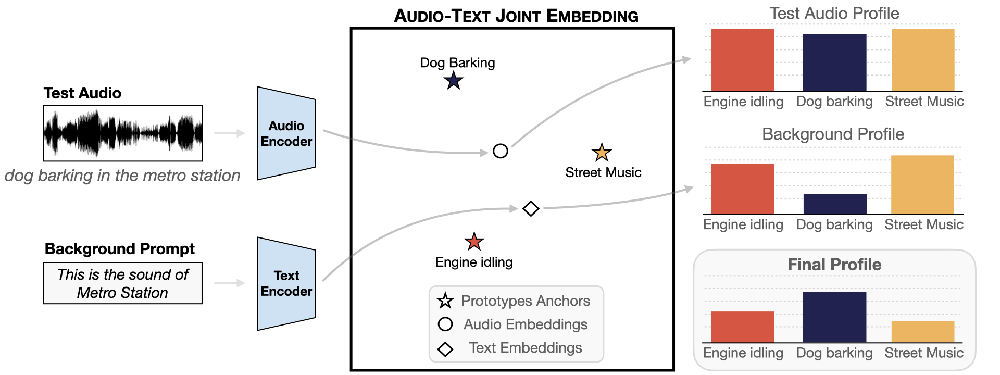

# AUDIO-TEXT DOMAIN ADAPATATION FOR SOUND CLASSIFICATION

Official release of the ICASSP 2025 paper: Domain Adaptation and Modality Gap in Audio-Text Models for Sound Classification 



## Setup

### Clone repository

```
git clone git@github.com:eacevedo1/AudioText-ContextDomainAdaptation.git
```

### Create environment

```
conda create --name atm-domain-adapt python=3.9
conda activate atm-domain-adapt
pip install -r requirements.txt
```

### Download the pretrained models

```
# Create the directory if it doesn't exist
mkdir -p models/LAION-CLAP

# Download the model into models/LAION-CLAP
wget -P models/LAION-CLAP https://huggingface.co/lukewys/laion_clap/resolve/main/630k-audioset-fusion-best.pt
```

## Download Datasets

To download datasets we run the `scripts/download_dataset.py` script. You can specify which dataset you want to download using the `--dataset_name argument`. For example, to download the `urbansound8k` dataset, you can use the following command:

```
python3 scripts/download_dataset.py --dataset_name urbansound8k 
```

The dataset will be automatically downloaded into the `data/input/` directory within the project. The script will handle downloading, cleaning up, and overwriting any existing files if necessary.

For more information on these datasets, refer to the [Soundata Documentation - Datasets](https://soundata.readthedocs.io/en/latest/source/quick_reference.html).

## Create Soundscapes

To create an augmented dataset by putting a foreground sound into a background soundscape, you should run the script `scripts/soundscape_augmentations.py`. An example command to execute the script is:

```
python3 scripts/soundscape_augmentations.py --folds 1,2,3 --parameters snr_dist=(const,6) n_soundscapes=2 bg=park
```

This codes generates a new dataset of `urbansound8k` with files in folds 1,2 and 3 using Scaper. In this case we generate 2 soundscapes for each foreground (`n_soundscapes=2`) with a setted background class `park`. If we want to use all backgrounds use parameters with `bg=all`. Also, is possible to overwrite some distribution of the generation, in this case we set SNR of the generated soundscape to 6dB (`snr_dist=(const,6)`).

## Exctract Audio Embeddings 

To extract embeddings from a dataset, use the `scripts/extract_embddings.py` script. This script processes the audio data and saves the extracted embeddings to a file.

Example command to extract embeddings from the urbansound8k dataset:

```
python3 scripts/extract_embddings.py --dataset urbansound8k --path urbansound8k-20240705184401
```

**Parameters:**
- `--dataset`: The name of the dataset from which you want to extract embeddings (e.g., urbansound8k, tau2019uas).
- `--path`: The folder path of the augmented dataset or original dataset. If working with an augmented dataset, provide the folder path (e.g., urbansound8k-20240705184401); otherwise, set it to None.
- `--num_workers`: (Optional) The number of workers to use for extracting embeddings (default: 1).

The embeddings will be saved as a `.pt` file in the `data/embeddings/` directory. The filename will follow the format `<dataset_name>_<timestamp>.pt`. 

This script automatically detects the available hardware (GPU, MPS, or CPU) to optimize the embedding extraction process.

## Sound Classification

The script `scripts/sound_classification.py` is is used to classify sounds using `LAION-CLAP` pre-trained audio-text model. To run the script, use the following command:

```
python3 scripts/sound_classification.py --embeddings_path <embeddings_path> --dataset <dataset> --mode <mode>
```

**Parameters:**

- `--embeddings_path`: The path to the pre-computed embeddings file.
- `--dataset`: The name of the dataset for classification (e.g., urbansound8k).
- `--modality`: (Optional) The modality to be used for domain adaptation. Set to 'text' for text-guided prototypes, 'audio' for audio-based background profiles, or None if no domain adaptation is needed.
- `--temperature`: (Optional) The temperature value for domain adaptation (default: 0.5).
- `--bg_embeddings_path`: (Optional) The path to the background embeddings file (only needed for audio domain adaptation).
- `--mode`: The training mode for classification. Choose from:
    * `zs`: Zero-shot classification.
    * `tgap`: Text-guided audio prototypes.
    * `sv`: Supervised classification.

The script will output accuracy metrics for each fold of the dataset and display the final classification score.

Example usage:

```
python3 scripts/sound_classification.py --embeddings_path embeddings/urbansound8k_1520.pt --dataset urbansound8k --mode zs
```

This example runs zero-shot classification on the urbansound8k dataset using the pre-computed embeddings.

## Inference Classification with Domain Adaptation

This script performs sound classification inference on audio files using domain adaptation techniques. The script can apply domain adaptation with either text or audio modalities to enhance classification accuracy. To run inference classification with domain adaptation, use the following command:

```
python3 scripts/inference_classification.py --class_labels <class_labels_path> --audio_folder_path <audio_folder_path> --modality <modality> --temperature <temperature>
```

**Parameters:**

- `--class_labels`: Path to the file containing the class labels (required).
- `--audio_folder_path`: Path to the folder containing the audio files to classify (required).
- `--modality`: Modality to use for domain adaptation. Options are:
    * `'text'` for text-based domain adaptation.
    * `'audio'` for audio-based domain adaptation.
None if no domain adaptation is needed.
- `--temperature`: (Optional) The temperature value for domain adaptation, default is 0.5.
- `--bg_type`: Specifies the type of background for text-based domain adaptation (e.g., park, airport, street traffic). Needed in case of using domain adpatation with modality `'text'`. 
- `--bg_folder_path`: Path to the folder containing background audio files for audio-based domain adaptation. Needed in case of using domain adpatation with modality `'audio'`. 
- `--num_workers`: (Optional) Number of workers to use for embedding extraction (default: 1).

The script processes the audio files from the specified folder, computes embeddings, applies domain adaptation if specified, and saves the classification results along with confidence scores.

1. Example Usage:

```
python3 scripts/inference_classification.py --class_labels class_labels.txt --audio_folder_path demo/inference_demo --modality text --temperature 0.5 --bg_type park
```

This example runs inference on audio files in the test_audios folder using text-based domain adaptation with a park background profile.

2. Example Usage:

```
python3 scripts/inference_classification.py --class_labels class_labels.txt --audio_folder_path demo/inference_demo --modality audio --temperature 0.5 --bg_folder_path demo/inference_bg_demo
```

This example runs inference on audio files in the test_audios folder using audio-based domain adaptation with a park background profile.